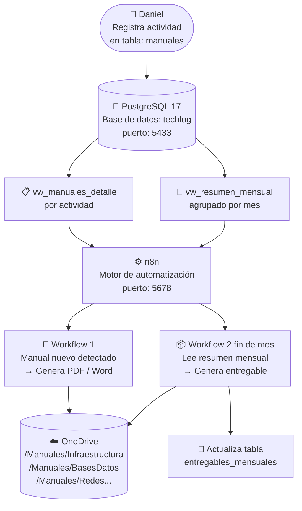

# TechLog DB

Sistema local para registrar instalaciones y configuraciones técnicas,
reemplazando el bloc de notas por una base de datos estructurada en
**PostgreSQL 17**, automatizada con **n8n** para generar manuales
profesionales y subir entregables mensuales a **OneDrive**.

---

## Diagrama de flujo



> El diagrama se renderiza automáticamente en GitHub y en cualquier
> visor Markdown que soporte Mermaid (VS Code con extensión, Obsidian, etc.)

---

## Stack del proyecto

| Componente | Versión       | Puerto | Descripción                              |
|------------|---------------|--------|------------------------------------------|
| PostgreSQL | 17-alpine     | 5433   | Base de datos principal                  |
| n8n        | latest        | 5678   | Motor de automatización de workflows     |

---

## Requisitos del sistema

### 🟢 Mínimos — para uso personal / pruebas
- CPU: 2 núcleos
- RAM: 4 GB
- Disco: 10 GB libres
- SO: Windows 10/11 con WSL2, Ubuntu 20.04+ o cualquier Linux
- Docker Engine 24+ y Docker Compose v2+

### 🟡 Recomendados — uso diario con varios workflows en n8n
- CPU: 4 núcleos
- RAM: 8 GB
- Disco: 20 GB libres (SSD)
- Conexión a internet estable (para integraciones con OneDrive y APIs)

### 🔴 Producción o servidor compartido
- CPU: 4+ núcleos
- RAM: 16 GB+
- Disco: 50 GB+ SSD
- Ubuntu Server 22.04 LTS
- Docker Engine 26+
- Backups automáticos configurados
- Dominio o IP fija para webhooks de n8n

---

## Estructura del proyecto

techlog-db/
├── docker-compose.yml ← Levanta PostgreSQL 17 + n8n
├── .env ← Credenciales reales (NO va al repo)
├── .env.example ← Plantilla sin credenciales (SÍ va al repo)
├── .gitignore
├── README.md
├── scripts/
│ └── autostart.sh ← Levanta contenedores al abrir WSL
└── postgres/
└── init/ ← Se ejecutan solos al crear el contenedor
├── 01_schema.sql ← Tablas: areas, manuales, entregables
├── 02_indexes.sql ← Índices de búsqueda
├── 03_views.sql ← Vistas y triggers para n8n
└── 04_seed.sql ← Datos de ejemplo


---

## Instalación

### 1. Clonar el repositorio

```bash
git clone https://github.com/tu-usuario/techlog-db.git
cd techlog-db
```

### 2. Configurar credenciales

```bash
cp .env.example .env
nano .env
```

### 3. Levantar los servicios

```bash
docker compose up -d
docker compose ps
```

### 4. Instalar arranque automático en WSL (una sola vez)

```bash
chmod +x scripts/autostart.sh

cat >> ~/.bashrc << 'EOF'

# techlog-db autostart
if ! docker ps | grep -q techlog_postgres; then
  if ! service docker status 2>&1 | grep -q "running"; then
    sudo service docker start
  fi
  bash ~/projects/techlog-db/scripts/autostart.sh
fi
EOF
```

Desde ese momento, al abrir WSL los contenedores se levantan solos.

---

## Accesos

| Servicio   | URL                   | Usuario      | Password          |
|------------|-----------------------|--------------|-------------------|
| **n8n**    | http://localhost:5678 | admin        | n8n_pass_2024     |
| PostgreSQL | localhost:5433        | techlog_user | techlog_pass_2024 |

---

## Conectarse desde DBeaver en Windows

1. **New Database Connection** → PostgreSQL
2. Datos de conexión:

| Campo    | Valor             |
|----------|-------------------|
| Host     | `localhost`       |
| Port     | `5433`            |
| Database | `techlog`         |
| Username | `techlog_user`    |
| Password | `techlog_pass_2024` |

3. **Test Connection** → **Finish**

---

## Registrar una actividad

```sql
INSERT INTO manuales (area_id, titulo, objetivo, prerrequisitos, pasos, notas, tags)
VALUES (
    (SELECT id FROM areas WHERE nombre = 'Infraestructura'),
    'Instalación de Nginx en Ubuntu',
    'Tener Nginx funcionando como reverse proxy',
    '- Ubuntu 22.04
- Puerto 80 disponible',
    '1. sudo apt install nginx
2. sudo systemctl enable --now nginx
3. nginx -v',
    'Abrir puerto 80: ufw allow 80',
    ARRAY['nginx','ubuntu','web']
);
```

---

## Consultas útiles

```sql
-- Ver todos los manuales con su área
SELECT * FROM vw_manuales_detalle;

-- Resumen del mes actual por área
SELECT * FROM vw_resumen_mensual
WHERE anio = EXTRACT(YEAR FROM NOW())
  AND mes  = EXTRACT(MONTH FROM NOW());
```

---

## Comandos de mantenimiento

```bash
# Estado de los contenedores
docker compose ps

# Logs en tiempo real
docker compose logs -f

# Detener (conserva datos)
docker compose down

# Borrar todo incluyendo datos
docker compose down -v

# Reiniciar un servicio
docker compose restart postgres
docker compose restart n8n
```

---

## Ejecución para otro usuario o PC

Este proyecto es 100% genérico. Para que otro usuario lo use:

### Se ejecuta:

```bash
# 1. Clonar el repo
git clone https://github.com/tu-usuario/techlog-db.git
cd techlog-db

# 2. Crear su propio .env con sus credenciales
cp .env.example .env
nano .env

# 3. Levantar todo
docker compose up -d

# 4. Instalar autostart (opcional, una sola vez)
bash scripts/install-autostart.sh
```

Cada quien tiene:
- Su propia base de datos local independiente
- Sus propios workflows en n8n
- Sus propias credenciales en `.env`
- El `.env` nunca se sube al repo (está en `.gitignore`)

## Roadmap

- [x] Fase 1 — PostgreSQL 17 con tablas, vistas y datos de ejemplo
- [x] Fase 1 — n8n integrado y conectado a PostgreSQL
- [x] Fase 1 — Arranque automático en WSL
- [ ] Fase 2 — Workflow n8n: leer manuales y generar PDF/Word profesional
- [ ] Fase 3 — Workflow n8n: subir PDF a OneDrive en ruta del área
- [ ] Fase 4 — Entregables mensuales automáticos por área
- [ ] Fase 5 — Formulario web para registrar sin escribir SQL